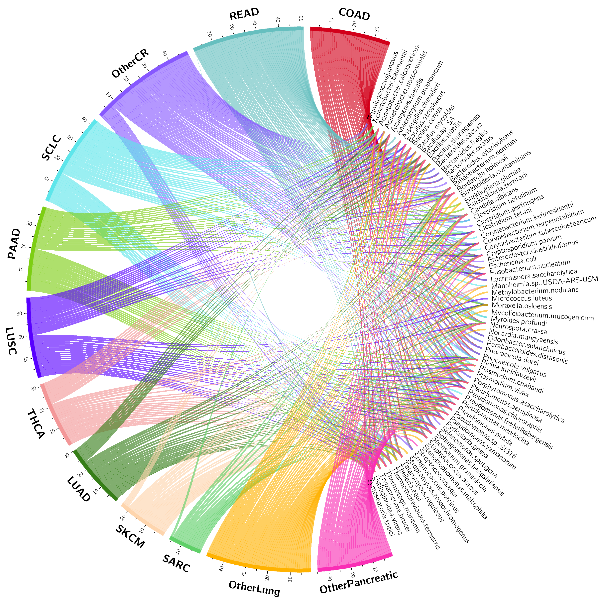

# MEGA (Microbial hEterogeneous Graph Attention) <a href='https://github.com/OSU-BMBL/MEGA'></a>

**Warning: This repository is under heavy development and the content is not final yet.**

MEGA is a deep learning-based python package for identifying cancer-associated intratumoral microbes.

If you have any questions or feedback, please contact Qin Ma <qin.ma@osumc.edu>.

The package is also available on PyPI: https://pypi.org/project/pyMEGA/

## News

### v0.0.5 - 4/14/2023
Updated:
1. Add tutorial for [circos plot](./figures/circos/README.md) and [network & upset plot](./figures/README.md)
   
### v0.0.5 - 3/12/2023
Updated:
1. Rename to MEGA

### v0.0.4 - 2/18/2023
Updated:
1. Grammar and spelling errors
2. Updated MEGA installation steps

### v0.0.3 - 2/16/2023
Added:
1. Complete workflow from raw abundance workflow and metadata labels to final prediction results
2. Improved tutorial for GPU and CPU version usage

### v0.0.2 - 2/3/2023
Added:
1. Example data using a TCGA subset
2. Example databases, including NJS16 metabolic database, NCBI taxonomy database

### v0.0.1 - 1/24/2023
Added:
1. GitHub published: https://github.com/OSU-BMBL/MEGA
2. PyPI published: https://pypi.org/project/pyMEGA/

## Dev environment

MEGA is developed and tested in the following software and hardware environment:

```{bash}
python: 3.7.12
PyTorch: 1.4.0
NVIDIA Driver Version: 450.102.04
CUDA Version: 11.6
GPU: A100-PCIE-80GB
System: Red Hat Enterprise Linux release 8.3 (Ootpa)
```

## Installation

The following packages and versions are required to run MEGA:

- python: 3.7+
- cuda: 10.2
- torch==1.4.0 (must be 1.4.0)
- torch-cluster==1.5.4
- torch-geometric==1.4.3
- torch-scatter==2.0.4
- torch-sparse==0.6.1
- R > 4.0
- taxizedb (An R package for NCBI database)

Note: It is **highly suggested** to install the dependencies using [micromamba](https://mamba.readthedocs.io/en/latest/installation.html#install-script) (about 10 mins) rather than ```conda``` (could take more than 2 hours). If you don't want to use micromamba, just simply replace ```micromamba``` with ```conda``` in the code below.

**if you have GPU available: check [GPU version (CUDA 10.2)](#gpu-version-cuda-102)**

**if you only have CPU available: check [CPU version](#cpu-version)**

### GPU version (CUDA 10.2)
1. Add channels using conda

```
conda config --add channels defaults
conda config --add channels bioconda
conda config --add channels conda-forge
```

2. Create a virtual environment for MEGA

```{bash}
micromamba create -n MEGA_env python=3.7 -y
```

3. Activate ```MEGA_env```

```{bash}
micromamba activate MEGA_env
```

4. install ```pytorch v1.4.0```

```{bash}
micromamba install pytorch==1.4.0 cudatoolkit=10.1 -c pytorch -y
```

5. install other required packages from pip

```{bash}
pip install dill kneed imblearn matplotlib tqdm seaborn pipx
```

6. install ```torch-geometric for pytorch v1.4.0```

```{bash}
pip install torch-scatter==2.0.4 torch-sparse==0.6.1 torch-cluster==1.5.4 torch-spline-conv==1.2.0 torch-geometric==1.4.3 -f https://data.pyg.org/whl/torch-1.4.0%2Bcu101.html
```

7. install ```MEGA```
```{bash}
pip install MEGA
```

8. install ```R and taxizedb```

```{bash}
micromamba install R -y
```

9. verify the installation
```{bash}
MEGA -h
```

### CPU version

1. Add channels using conda

```{bash}
conda config --add channels defaults
conda config --add channels bioconda
conda config --add channels conda-forge
```
2. Create a virtual environment for MEGA

```{bash}
micromamba create -n MEGA_cpu_env python=3.7 -y
```

3. Activate ```MEGA_cpu_env```

```{bash}
micromamba activate MEGA_cpu_env
```

4. install ```pytorch v1.4.0```

```{bash}
#micromamba install pytorch==1.4.0 cpuonly -c pytorch -y
pip install torch==1.4.0+cpu -f https://download.pytorch.org/whl/torch_stable.html
```

5. install other required packages from pip

```{bash}
pip install dill kneed imblearn matplotlib tqdm seaborn pipx
```

6. install ```torch-geometric for pytorch v1.4.0```

```{bash}
pip install torch-scatter==2.0.4 torch-sparse==0.6.1 torch-cluster==1.5.4 torch-spline-conv==1.2.0 torch-geometric==1.4.3 -f https://data.pyg.org/whl/torch-1.4.0%2Bcpu.html
```

7. install ```MEGA```
```{bash}
pip install pyMEGA
```

8. install ```R and taxizedb```

```{bash}
micromamba install R -y
```

9. verify the installation
```{bash}
MEGA -h
```


## Input data

### Data format

1. **Abundance matrix**: A CSV matrix. The first column represents the species IDs or official NCBI taxonomy names. The first row represents the sample names. MEGA will automatically try to convert the species name to IDs when needed.


2. **Sample labels**: A CSV matrix with a header row. The first column represents the species IDs or official NCBI taxonomy names. The first row represents the sample names. MEGA will automatically try to convert the species name to IDs when needed.


### Example data

```cre_abundance_data.csv```: The abundance matrix has 995 species and 230 samples

```cre_metadata.csv```: The sample labels of the corresponding abundance matrix. It has 230 rows (samples) and 2 columns

```NJS16_metabolic_relation.txt```: Human gut metabolic relationship database (reference: https://www.nature.com/articles/ncomms15393). MEGA will load the built-in NJS16 metabolic database if users did not provide it. You can find the database content [here](https://raw.githubusercontent.com/OSU-BMBL/MEGA/master/MEGA/data/NJS16_metabolic_relation.txt)

```{bash}
wget https://raw.githubusercontent.com/OSU-BMBL/MEGA/master/MEGA/data/cre_abundance_data.csv

wget https://raw.githubusercontent.com/OSU-BMBL/MEGA/master/MEGA/data/cre_metadata.csv

```

## How to run MEGA

We will use the [example data](#example-data) for the following tutorial.

### Quick start

- ```input1```: the path to the abundance matrix
- ```input2```: the path to the sample metadata
- ```cuda```: which GPU device to use. Set to -1 if you only have CPU available

Running time:

- GPU version: about 15 mins
- CPU version: about 60 mins

#### GPU version

```{bash}
MEGA -cuda 0 -input1 cre_abundance_data.csv -input2 cre_metadata.csv -db NJS16_metabolic_relation.txt -o ./out
```

#### CPU version

```{bash}
MEGA -cuda -1 -input1 cre_abundance_data.csv -input2 cre_metadata.csv -db NJS16_metabolic_relation.txt -o ./out
```

### Enabling other parameters

use ```MEGA -h``` to check more details about parameters

```{bash}

INPUT1=cre_abundance_data.csv
INPUT2=cre_metadata.csv
DB=NJS16_metabolic_relation.txt
CUDA=0
LR=0.003
N_HID=128
EPOCH=30
KL_COEF=0.00005
THRES=3
OUTPUT=./out
MEGA -input1 ${INPUT1} -input2 ${INPUT2} -db ${DB} -epoch ${EPOCH} -cuda ${CUDA} -n_hid ${N_HID} -lr ${LR} -kl_coef ${KL_COEF} -o ${OUTPUT}

```

## Output files

1. ```*_final_taxa.txt``` : Cancer-associated microbal signatures. This is an unstructured txt file separated by tabs. This is the final output file.


1. ```*_taxa_num.csv``` : normalized attention score for each species under each cancel label

2. ```*_metabolic_matrix.csv```: metabolic relationship network extracted from database

3. ```*_phy_matrix.csv```: phylogenetic relationship network extracted from NCBI taxonomy database

4. ```*_attention.csv```: raw attention matrix extracted from deep learning model

## Visualization

### UpSet plot and Cytoscape figures

Check the README file in ```./figures``` folder:

[./figures/README.md](./figures/README.md)


### Circos plot

Check the README file in ```./figures/circos``` folder:

[./figures/circos/README.md](./figures/circos/README.md)



## Acknowledgements

Maintainer: [Cankun Wang](https://github.com/Wang-Cankun)

Contributors:

- Cankun Wang
- Megan McNutt
- Anjun Ma
- Zhaoqian Liu
- Yuhan Sun

Contact us: Qin Ma <qin.ma@osumc.edu>.
