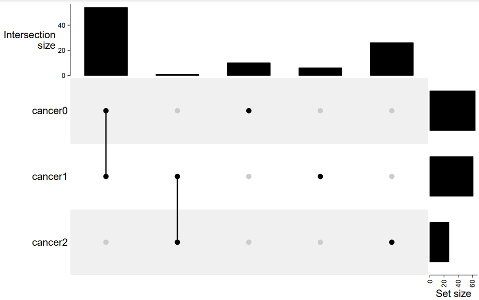
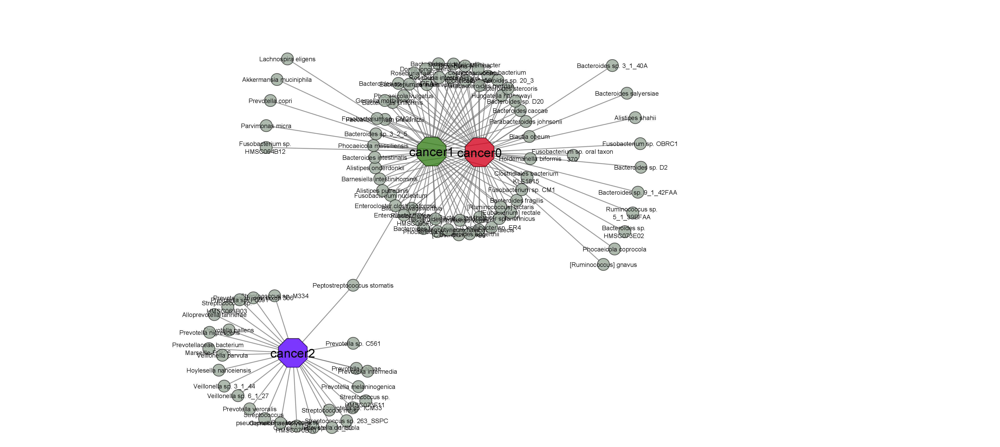
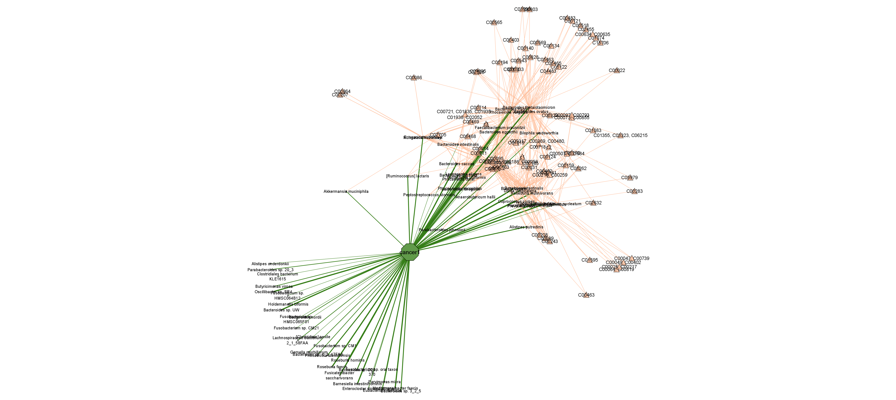
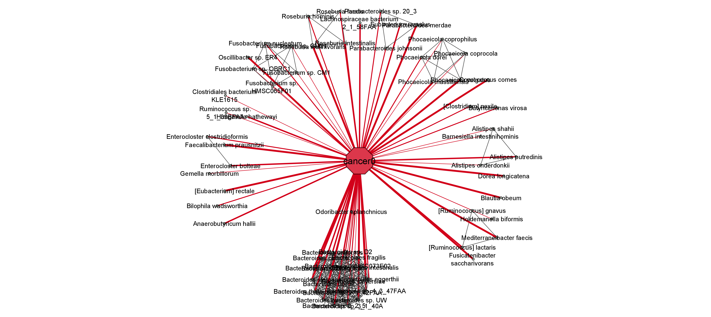

# Visualize pyMEGA results

Make UpSet figures and Cytoscape Networks

Note: The visualization code was created and tested using R and Cytoscape in Windows OS. Not supported in the terminal environment.

## Installation

The following packages were used for development:

- R: 4.2.1
- Cytoscape: 3.9.1
- Rcy3: 2.19.0
- igraph: 1.3.5
- tidyverse: 1.3.2
- reshape2: 1.4.4

## Prepare data for figures

1. Set up the file name in prepare_figure_data.r
2. Run the rest of the code of prepare_figure_data.r

## Upset plot

Set up the correct file path and ```run plot_upset.r``` using the .rds file generated in the previous step.

Example result:


## Cytoscape networks

### How to use

1. Open the Cytoscape desktop version. The code requires the Rcy3 package to build API conenction with the desktop Cytoscape. 

To install the Rcy3 package, run the following code in R Studio:
```
if (!require("BiocManager", quietly = TRUE))
    install.packages("BiocManager")

BiocManager::install("RCy3")
```
2. Download SCENIC+.xml and import it in Cytoscape style. [Here](https://manual.cytoscape.org/en/stable/Styles.html#:~:text=You%20can%20import%20the%20sample,Import%20%E2%86%92%20Styles%20from%20File%E2%80%A6.) is the official doc that can be used to import the sample file. To import in Cytoscape style, follow the path File → Import → Styles from File.

3. It is recomended to run the following code line-by-line in Rstudio since it is easier to adjust network parameters.

### Plot all cancer types

1. Open ```plot_all_cancer.r```. 
2. Change the working directoy to your local directory where ```plot_all_cancer.r``` is located.
3. Make sure to change the file name to reflect the ```_result.rds``` file generated in the ```prepare_figure_data.r``` code.

Example output:



### Plot one cancer with metabolic edge

Check ```plot_one_cancer_with_metabolic_edge.r```



### Plot one cancer with phylogenetic edge

Check ```plot_one_cancer_with_phylogenetic_edge.r```

