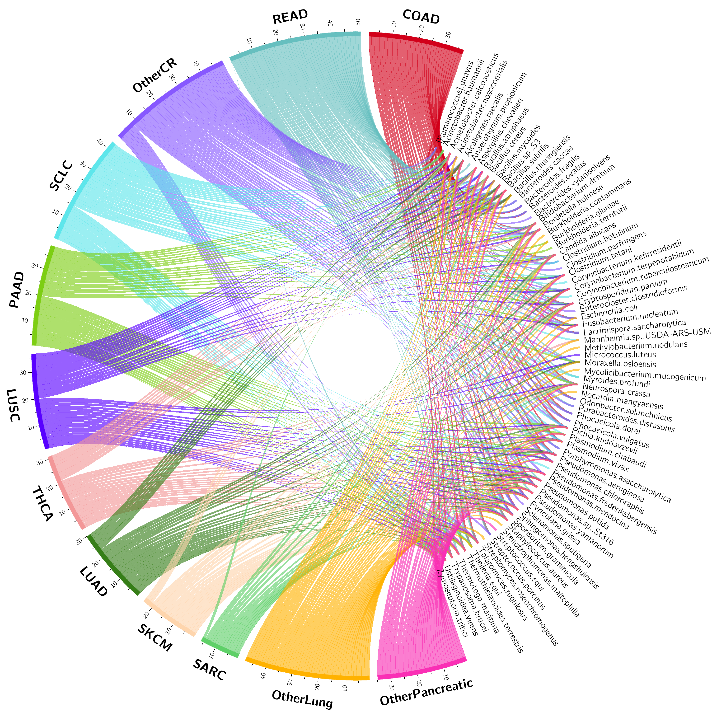

# Generate Circos Plot

## Prepare Data for Circos

1. Execute the `prepare_circos_data.r` script

2. The script will generate three output files:
   1. `mega_data.txt`: Data for segment length (previously referred to as ideogram)
   2. `mega_label.txt`: Data for species names
   3. `mega_link.txt`: Links between cancer types and species

## Run circos

1. Ensure that you are in the correct directory and that [Circos](http://circos.ca/) is installed successfully. If not, follow the [installation guide](http://circos.ca/documentation/tutorials/quick_start/install/) to install Circos.

2. run ```circos```
3. The output will be two image files, `circos.png` and `circos.svg`, containing the Circos plot.


